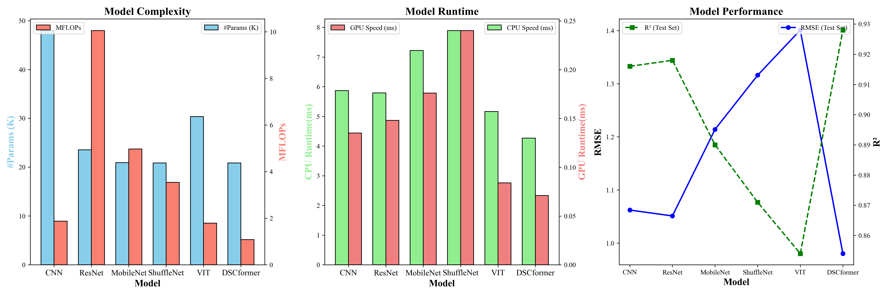
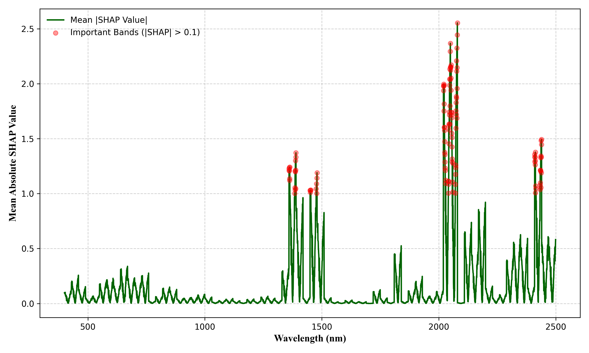

# 🚀DSCformer
 DSCformer: Lightweight model for predicting soil nitrogen content using VNIR-SWIR spectroscopy
 
- **Innovative Lightweight Model:** This paper introduces DSCformer, a novel lightweight model based on a new architecture that combines deep learning with spectral techniques.
- **Superior Performance:** DSCformer outperforms other deep learning methods, including CNN, ResNet, VIT, MobileNet, and ShuffleNet.
- **Lightweight and Efficient:** DSCformer is exceptionally lightweight with the fewest parameters and minimal computational requirements, making it highly efficient. It demonstrates fast CPU and GPU speeds.
- **Practical Application Potential:** DSCformer has the potential to facilitate the practical deployment of deep learning models in soil spectral prediction.
## :books: Introduction
 We present **DSCformer**, a lightweight and high-precision deep learning model for predicting soil nitrogen content. 
 
 Combining the feature extraction capabilities of the **Metaformer architecture** with the efficiency of **deep separable convolution(DSC)**, DSCformer achieves a breakthrough in balancing accuracy and computational efficiency for soil nutrient prediction.

 

**Key innovations** of DSCformer include:
- Integration of **deep separable convolution(DSC)** to reduce model complexity.
- A highly efficient architecture with only **20.86K parameters** and **1.08 MFLOPs**.
- Superior performance, achieving **RMSE: 0.98 g·kg⁻¹**, **R²: 0.928**, and ultra-fast runtimes (**4.265ms on CPU**, **0.071ms on GPU**).
- Enhanced **interpretability** using the **SHAP method**, which highlights critical spectral bands (e.g., **2020-2080 nm**, **2410-2440 nm**).


This work has been published in the journal COMPUTERS AND ELECTRONICS IN AGRICULTURE, marking an step toward practical, efficient, and interpretable soil nutrient prediction using deep learning techniques.
## :chart_with_upwards_trend: Dataset
 The following two datasets can be used:
|DataSet|URL|
| ----------- | ----------- |
|LUCAS 2015 TOPSOIL data|https://esdac.jrc.ec.europa.eu/content/lucas2015-topsoil-data|
|LUCAS 2009 TOPSOIL data **(Recommended)**|https://esdac.jrc.ec.europa.eu/content/lucas-2009-topsoil-data|

## :clipboard: Requirements
```
einops==0.8.0
matplotlib==3.2.2
numpy==1.19.5
pandas==1.1.5
ptflops==0.7
scikit_learn==0.23.2
scipy==1.5.4
tensorboardX==2.4
tensorboardX==2.6.2.2
thop==0.1.1.post2209072238
torch==1.9.1+cu111
torchsummary==1.5.1
tqdm==4.61.2
```
## Usage
- After downloading the code locally, you can run the example by directly running the **train.py** file, the dataset used in the example is in the test data folder.
- The **model.py** file contains the DSCformer model. You can change the model configuration by configuring the incoming parameters of the **dsc** function, including Token Mixer, Patch Size, DSCers_num, and so on.
- The file **model_analysis.py** contains a series of evaluations of the model, which can be run to obtain a series of information about the model, including the specific structure, run time, etc..
